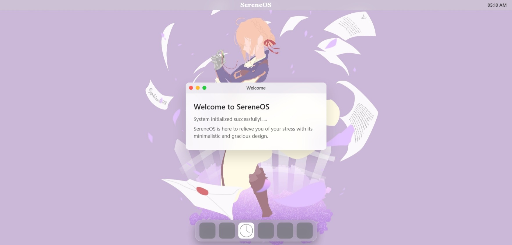

Hello World!!
Welcome to my custom web OS. The Serene OS is a minimalistic OS you will be able to run in your browser itself. 

The desktop layout is based on MacOS layout. The app icons will do a hover animation when you pass above them. After starting, it shows a welcome message in a draggable window.

    - Press the red button to close the window
    - Press the yellow button to minimise it (though you won't be able to get it back)
    - Press the green button to maximise it.

It also has a basic clock app that runs inside an iframe with another html file having the logic and is sandboxed here. 

sidenote: Serene OS was inspired by this scene int he anime Violet evergarden where violet tries to walk on water and for a moment we see her landing and walking for two steps before falling. It cannot be described in words but that moment felt really serene and inspiring.

PS: Note the earlier commits are from my old account. I did not change the account globally (forgot) so this accident happened. Do not mistake this for commits by different people.