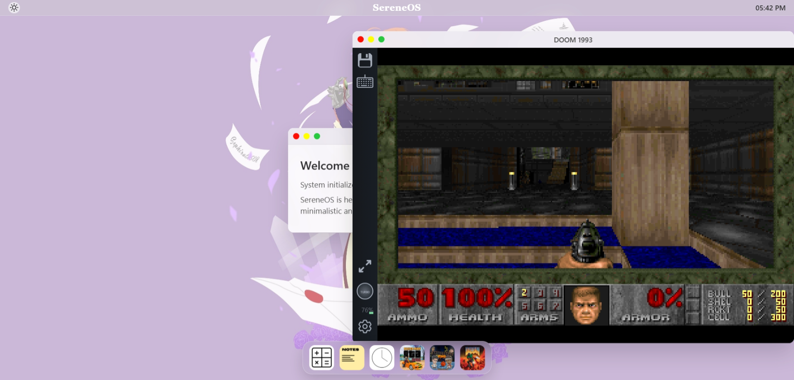

Hello World!!
Welcome to my custom web OS. The Serene OS is a minimalistic OS you will be able to run in your browser itself. 

features: 

    - 6 working apps which include: notes, calculator, clock and 3 games (one of which is the original 1993 DOOM [It was the hardest one to set up 😭] others were just embeded in iframe.)
    - a dark theme with a cool dark wallpaper (oress the button on the top left corner of the screen to toggle modes)
    - a calming background music to help you calm down
    - working minimise, maximise and close buttons

This is the biggest project of my journey yet and it makes me happy to share it with you!! hope you enjoy your experience here. It will make all the headache really worth it!

My learnings: As my files grew in number and my code gre larger and larger. It became harder to organise and really "not nice" to look at. The projects out there have a modelled and cool file tree that just looks proffesional while mine looks outright like someone dumped the files 😭 

SIDE NOTE: This was made to look like mac OS and ik it looks like a macos knockoff. But that doesnt mean it's just an ai oneclick website. I took the macos design because apple has some really high paid designers sitting there to create apple design and thats why they turn out really smooth. Rather than creating my own design which would be floppy I took their minimalistic and slick design. First designed it in canva then made made the css styling for it. 

sidenote: Serene OS was inspired by this scene int he anime Violet evergarden where violet tries to walk on water and for a moment we see her landing and walking for two steps before falling. It cannot be described in words but that moment felt really serene and inspiring.

PS: Note the earlier commits are from my old account. I did not change the account globally (forgot) so this accident happened. Do not mistake this for commits by different people.